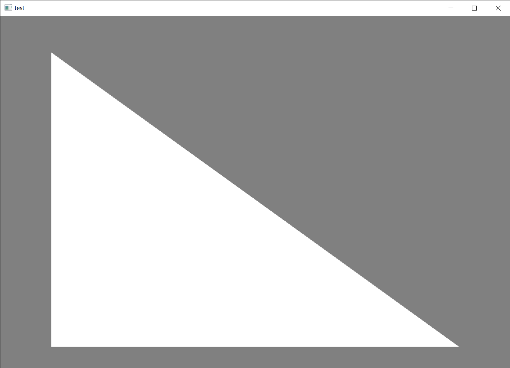
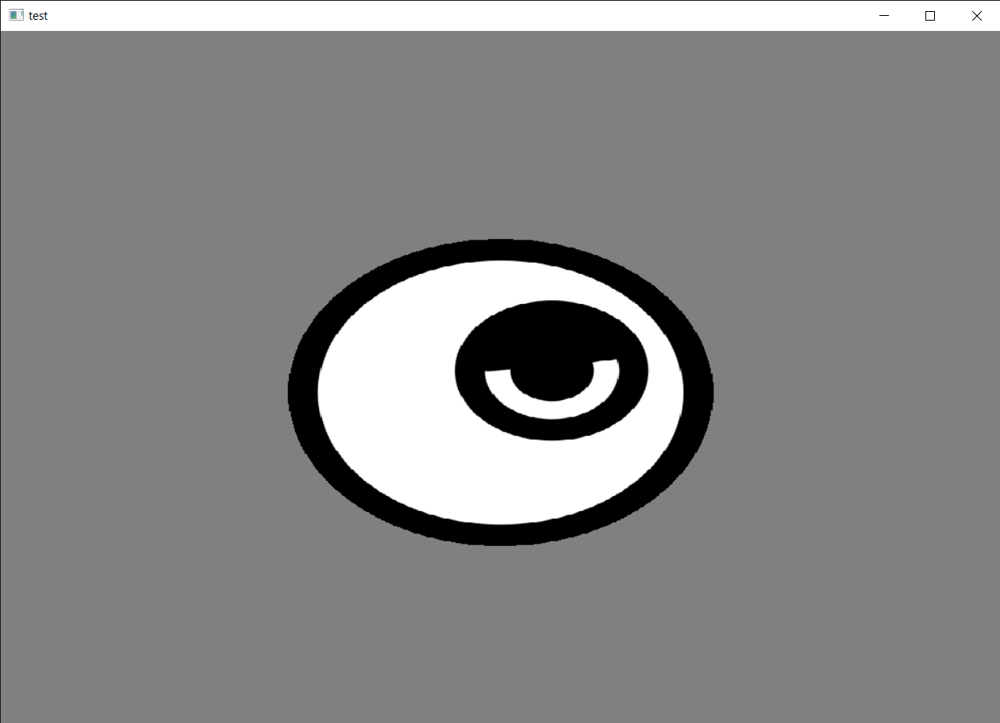
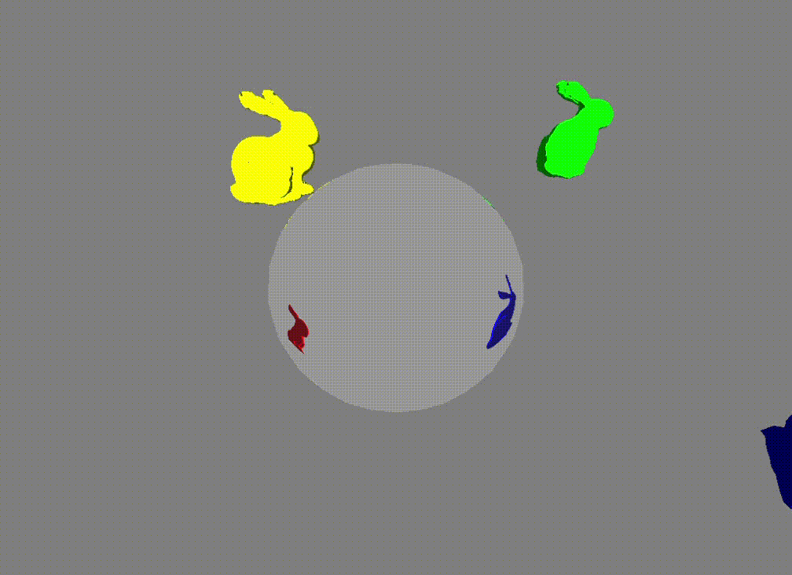
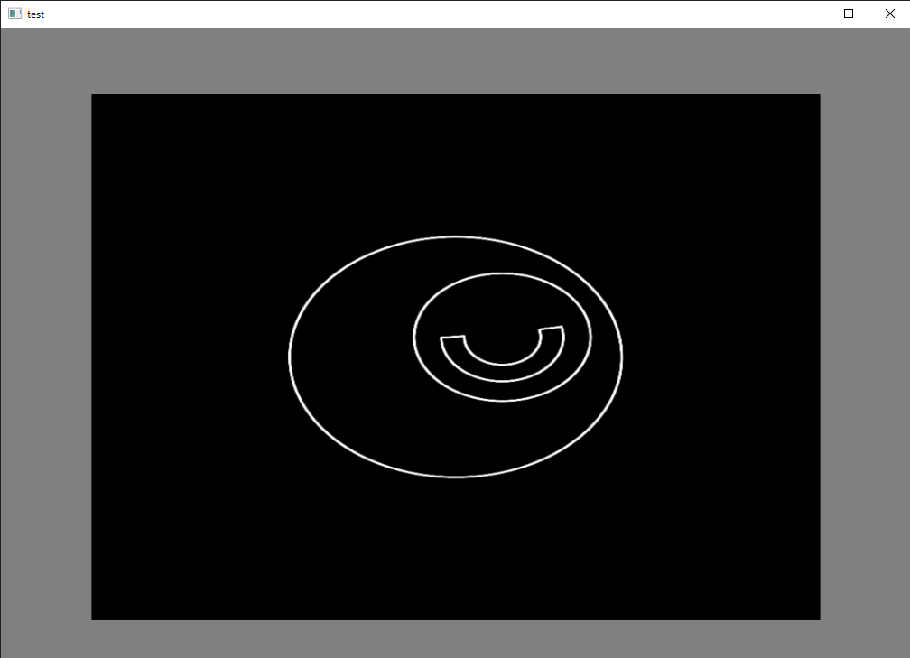
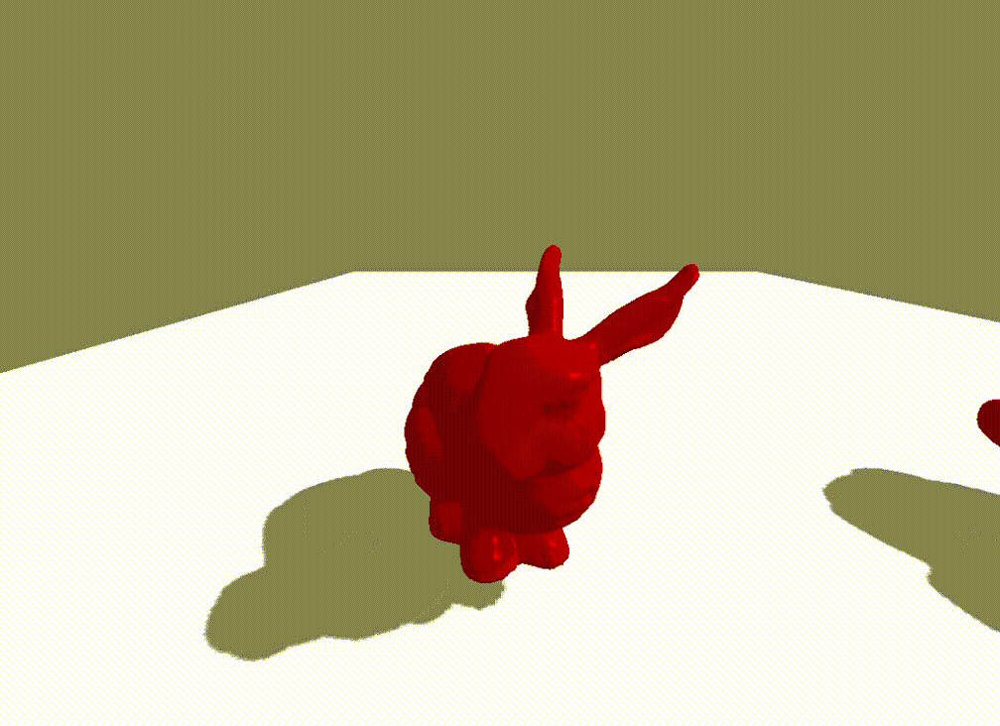
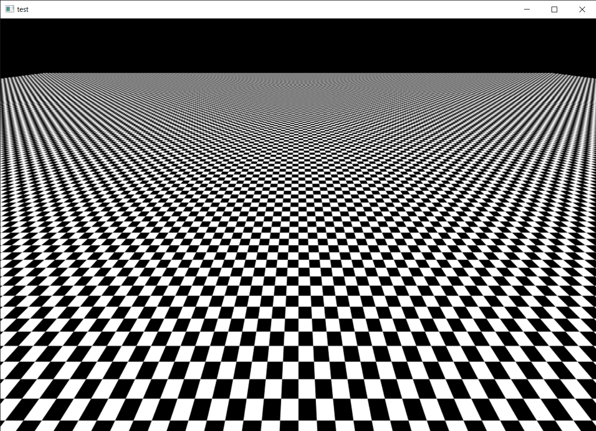

#結果

test001

三角形の描写

test002

画像の描写

test003

ジオメトリシェーダを使用した法線描画

test004

キューブマップを使用した鏡の表現

test005

テッセレーションを用いた地形の表現

test006

コンピュートシェーダを用いた輪郭抽出

test007

雪の表現

test008 

ポアソンディスクサンプリングを利用した影の表現

test009

分散シャドウマップ

影が重なる部分がおかしい

test010

ミップマップ

